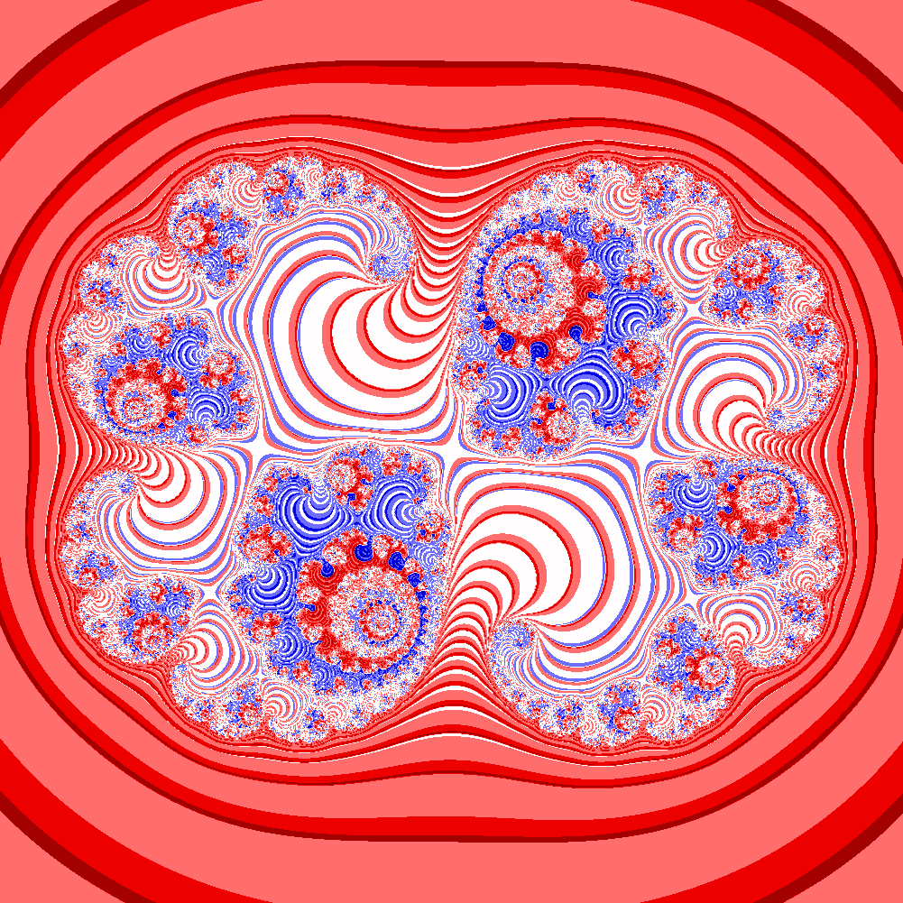

# Julia set

Command line interface

    python JuliaSet.py -h
    usage: JuliaSet.py [-h] [-k [K [K ...]]] [-s SIZE] [-x X] [-c COLORMAP]
                    [--pattern PATTERN] [-o OUTPUT] [-n NUMBER] [-p]

    Generate a julias set fractal curve

    optional arguments:
    -h, --help            show this help message and exit
    -k [K [K ...]]        complex number used to create Julia set. Two numbers
                            have to be given for animation. Default is
                            0.285+0.01j. (default: [(0.285+0.01j)])
    -s SIZE, --size SIZE  size of the generated image. (default: 401)
    -x X                  domain size of the fractal. Default is 2.0, meaning a
                            -2 x +2, -2 x +2 square will be created. (default:
                            2.0)
    -c COLORMAP, --colormap COLORMAP
                            name of the matplotlib colormap to use. (default:
                            autumn)
    --pattern PATTERN     pattern use to control output. A letter corresponds to
                            a picture, several letters can be given. Description
                            is given below. (default: abcde)
    -o OUTPUT, --output OUTPUT
                            name of the generated file. If not provided, result
                            will display on screen. (default: None)
    -n NUMBER, --number NUMBER
                            number of pictures to generate between two complex
                            numbers. Default is 2. (default: 2)
    -p, --parallel        boolean used to create images in a parallel way. It
                            used the (n-1) cores. Default is False. (default:
                            False)

    # Display help
    python JuliaSet.py --help

    # Create a Julia set fractal with k=0.285+0.01j with 501 points and a square with half-length of 1.25
    python JuliaSet.py -s 501 -x 1.25 -k 0.285+0.01j

    # Create an animation with 50 frames that covers from 0.285+0.01j to 0.285+0.02j
    python JuliaSet.py -s 501 -x 1.25 -k 0.285+0.01j 0.285+0.02j -n 50 -o animation.mp4

    # Same as previous but with fully developped argument and parallel execution
    python JuliaSet.py --size 501 -x 1.25 -k 0.285+0.01j 0.285+0.02j -number 50 --parallel

    # Pattern describes the output displayed. Possible letter are:
    a : Real part of Z
    b : Norm of Z
    c : Imaginary part of Z
    d : Convergence level
    e : Ponderation between norm and convergence level

    # Available colormaps are
    Accent, Blues, BrBG, BuGn, BuPu, CMRmap, Dark2, GnBu, Greens, Greys, OrRd, Oranges, PRGn, Paired, Pastel1, Pastel2, PiYG, PuBu, PuBuGn, PuOr, PuRd, Purples, RdBu, RdGy, RdPu, RdYlBu, RdYlGn, Reds, Set1, Set2, Set3, Spectral, YlGn, YlGnBu, YlOrBr, YlOrRd, afmhot, autumn, binary, bone, brg, bwr, cool, coolwarm, copper, cubehelix, flag, gist_earth, gist_gray, gist_heat, gist_ncar, gist_rainbow, gist_stern, gist_yarg, gnuplot, gnuplot2, gray, hot, hsv, jet, nipy_spectral, ocean, pink, prism, rainbow, seismic, spectral, spring, summer, terrain, winter

